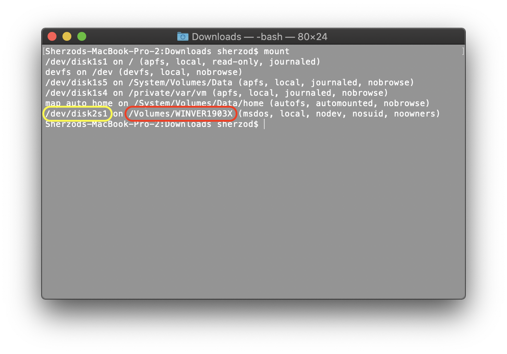

# FATSORT - Console App for macOS Catalina

This is a version of [FATSORT (v. 1.6.2.605)](https://fatsort.sourceforge.io) that was modified to be able to compile for macOS Catalina.

### Backstory

When using hardware devices to play music from SD cards or USB disks, you may find that they play files in non-alphabetical order. While this not a case for modern devices like iPhone, iPod or devices that Android base. However, this problem still exists on devices even at flagship car audio systems like Sony RSX-GS9.

There are a lot of other [apps](http://www.murraymoffatt.com/software-problem-0010.php) that can solve this problem, despite, **FATSORT** is the only one that can work at macOS.

## How to Use

- Extract the source, copy **fatsort** file to any folder you want (for example to _Downloads_ fodler).
- Open Terminal and change directory to the **fatsort** file location.
``` shell
cd ~/Downloads
```
- Connect your flash drive and run **mount** command to see flash drive location.
``` shell
mount
``` 


_This image shows how to distinguish connected usb drive (highlighted with yellow) and it mounted volume path (highlighted with red)._

- Run **diskutil unmount “Volume”**.

``` shell
diskutil unmount /Volumes/WINVER1903X
```
- Run **fatsort** from Terminal with sudo and specify usb drive path.

``` shell
sudo ./fatsort /dev/disk2s1
```

To pass a option command to **FATSORT**, read more about options [here](https://fatsort.sourceforge.io/fatsort.1.html#DESCRIPTION).

## How to compile

- Download latest [Xcode and Xcode command line](https://developer.apple.com/download/more/).
- Extract the source, open Terminal and change directory to the source location (src folder).
- Build the software by running the make command.

## Author

FATSORT written by **Boris Leidner**.

modified by **Sherzod Khashimov**.

## License

Copyright © 2004−2019 Boris Leidner. 

License GPLv2: GNU GPL version 2.